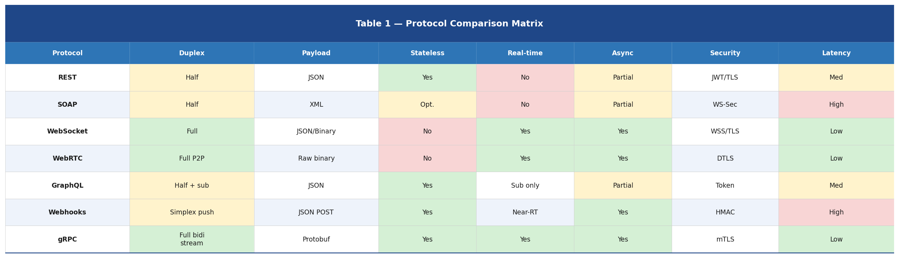
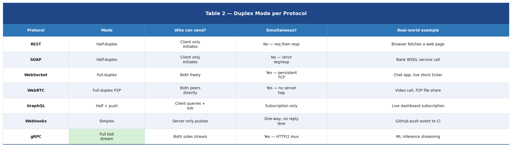
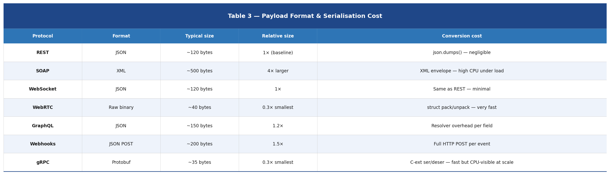
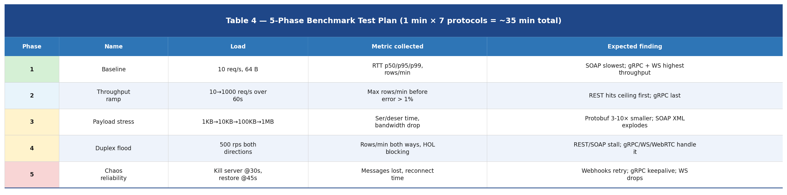
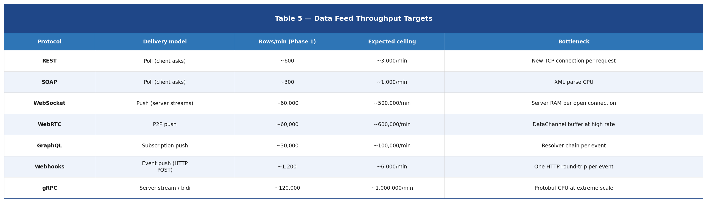
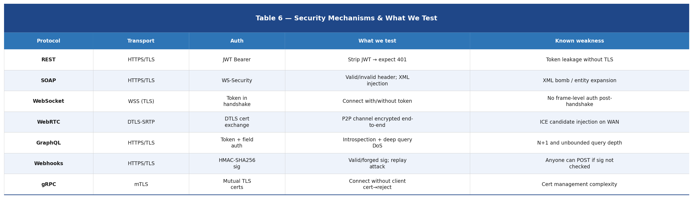
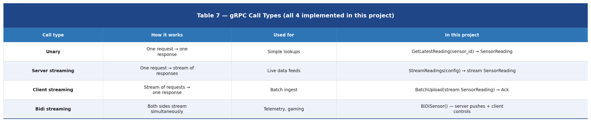
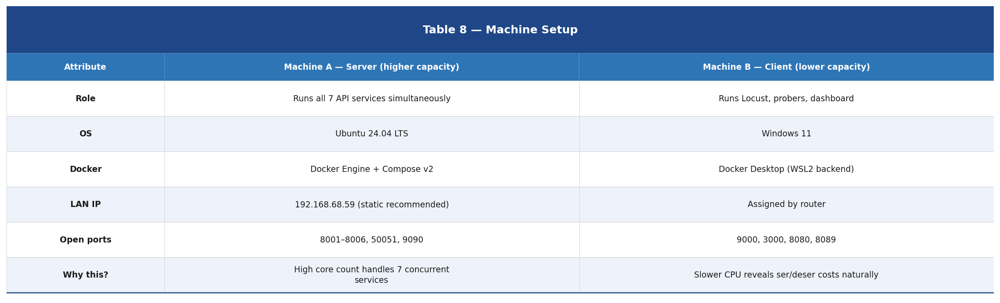
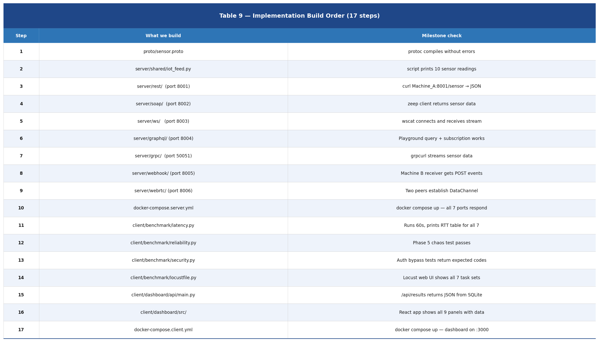

# API Benchmarking Lab

> **Understanding 7 API protocols through real measurement**
> REST · SOAP · WebSocket · WebRTC · GraphQL · Webhooks · gRPC

A two-machine local-network project that builds, deploys, and stress-tests all major API communication paradigms. Every protocol delivers the same IoT sensor data feed — differences emerge under load.

---

## What this project answers

- Why does gRPC outperform REST for high-frequency streaming?
- What does *stateless* actually cost, and what does it save?
- When does SOAP's XML overhead become the bottleneck?
- What happens to a Webhook stream when the receiver goes offline?
- How does Protobuf serialisation compare to JSON at millions of messages/sec?
- Why is WebRTC latency lower than WebSocket even on the same LAN?

---

## Protocol comparison matrix



---

## Duplex mode — who can send and when?



---

## Payload format & serialisation cost



---

## 5-phase benchmark test plan

Each phase runs against all 7 protocols. Total automated run ≈ 35 minutes.



---

## Data feed throughput targets

The same IoT sensor payload `{ sensor_id, temp, humidity, ts }` is delivered through every protocol. Comparisons are apples-to-apples.



---

## Security mechanisms & what we test



---

## gRPC call types (all 4 implemented)



---

## Machine setup



---

## Implementation build order



---

## Tech stack

| Layer | Technology |
|---|---|
| Server framework | Python FastAPI |
| gRPC | grpcio + grpcio-tools |
| SOAP | spyne (server) + zeep (client) |
| GraphQL | strawberry-graphql |
| WebRTC signalling | aiortc |
| Stress testing | Locust |
| Containerisation | Docker Compose v2 |
| Results store | SQLite |
| Metrics | Prometheus |
| Dashboard frontend | React + Vite |
| Dashboard backend | FastAPI |
| Schema contract | Protobuf (.proto) |

---

## Repository layout

```
api-benchmark-lab/
├── proto/
│   └── sensor.proto              # shared Protobuf schema
├── server/
│   ├── shared/iot_feed.py        # IoT sensor data generator
│   ├── rest/                     # FastAPI REST  :8001
│   ├── soap/                     # spyne SOAP    :8002
│   ├── ws/                       # WebSocket     :8003
│   ├── graphql/                  # GraphQL       :8004
│   ├── webhook/                  # Webhook emit  :8005
│   ├── webrtc/                   # WebRTC signal :8006
│   ├── grpc/                     # gRPC          :50051
│   └── docker-compose.yml        # starts all services on Machine A
├── client/
│   ├── benchmark/
│   │   ├── latency.py            # RTT p50/p95/p99 prober
│   │   ├── reliability.py        # chaos / reconnect tester
│   │   ├── security.py           # auth bypass checks
│   │   └── locustfile.py         # Locust stress scenarios
│   ├── webhook_receiver/         # receives + verifies Webhook POSTs :9000
│   ├── dashboard/
│   │   ├── api/                  # FastAPI backend reads SQLite
│   │   └── src/                  # React + Vite — 9 benchmark panels
│   └── docker-compose.yml        # starts benchmark suite on Machine B
├── results/
│   └── benchmark_results.db      # SQLite written by all probers
└── docs/
    └── images/                   # table images used in this README
```

---

## Quick start (after environment setup)

**Machine A (server)**
```bash
git clone https://github.com/<your-handle>/api-benchmark-lab
cd api-benchmark-lab/server
docker compose up -d
```

**Machine B (client)**
```bash
git clone https://github.com/<your-handle>/api-benchmark-lab
cd api-benchmark-lab/client
SERVER_IP=192.168.68.59 docker compose up
# Dashboard → http://localhost:3000
# Locust UI → http://localhost:8089
```

---

## Project phases

| Phase | What happens |
|---|---|
| 0 — Environment | Docker installed on both machines, LAN ping verified |
| 1 — Foundation | sensor.proto + iot_feed.py — the shared data contract |
| 2 — Server | All 7 API services built and running on Machine A |
| 3 — Client | Latency, reliability, security probers + Locust on Machine B |
| 4 — Dashboard | React frontend + FastAPI backend wired to SQLite results |
| 5 — Benchmark run | All 5 test phases executed, results analysed |

---

*Pre-implementation design document available in the repo as `docs/API_Benchmarking_Lab_Design_Document.docx`*
